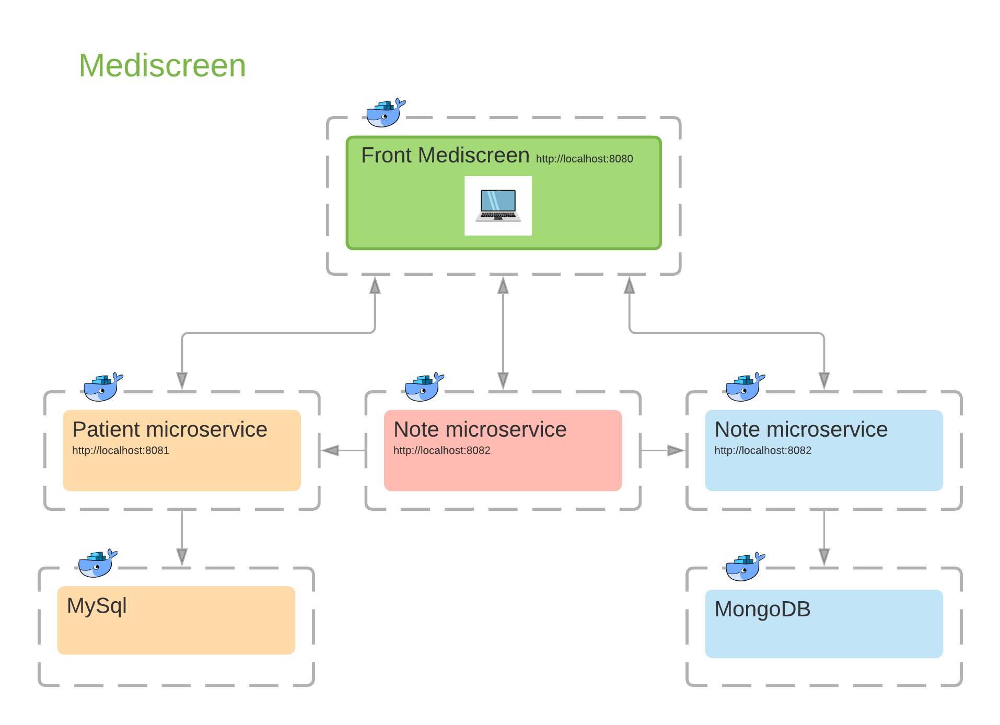

# Mediscreen is an Abernathy Clinic application


>This application makes it possible to manage the files of patients followed in a clinic and to detect the risks of diseases linked to diabetes.

## 1. Requirements

Front mediscreen service / Patient microservice / Note microservice / Assessment microservice 
- Java 11 
- Spring Boot 2.5.4
- Gradle 7.1.1
- JUnit 5.7.2
- MySql 8.0
- MongoDb 5.0
- Docker Engine 20.10.8
- Workbench 8.0 for MySql
- Robot 3T for MongoDB

### 1.1 Setup with Intellij IDE
- Download project on GitHub
- Open and Trust project to IntelliJ

### 1.2 Setup Docker image
- To avoid modifying the docker-compose.yml file, use docker commands to create an image per microservice. 
- To create an image by microservice, do not forget to be in the correct folder to launch the command.
```bash
docker build -t front_mediscreen . 
(with port 8080)
docker build -t patient_microservice . 
(with port 8081)
docker build -t note_microservice . 
(with port 8082)
docker build -t assessment_microservice . 
(with port 8083)
```
### 1.3 Start docker-compose
- Start the creation of the Docker container with the following command:
```bash
docker-compose up 
```
## 2. Diagram


## 3. Technic Documentation and Endpoints
- Front Mediscreen: http://localhost:8080/swagger-ui.html#/
- Patient microservice: http://localhost:8081/swagger-ui.html#/
- Note microservice: http://localhost:8082/swagger-ui.html#/
- Assessment microservice : http://localhost:8083/swagger-ui.html#/

## 4. Material used
Intel I7 7700k / Samsung SSD 970 Evo+ Nmve / 48GB RAM
